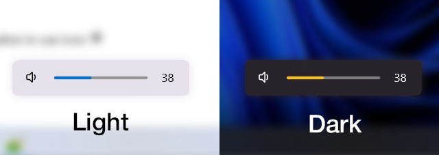

# Collection of Windows scripts


## Auto Dark Mode helper script

Auto Dark Mode allows you to switch between light and dark themes, but it causes OS interface artifacts. This script will help you get rid of them.

### Features

- Prevent ADM script multiple instance (lock file)  
- Restart `explorer.exe` and restore tabs  
- Launch external scripts  
- Refresh ADM theme to fix wallpaper not changing error (force theme toggle)  
- Restore last active window (ps_foregroundWindow.ps1)

### Installation

#### Pre-setup

1. [Download](https://github.com/AutoDarkMode/Windows-Auto-Night-Mode) and install ADM
2. Create light and dark themes in the Windows Theme menu
3. Choose them in ADM: `Personalization` -> `Pick a theme`
4. Set the time for switching themes

#### Automatic installation via PowerShell (recommended)

```powershell
cd $env:USERPROFILE;`
gci -dir|?{($_.name -eq "win_scripts") -or ($_.name -eq "win_scripts-master")}|ri -rec -for;`
gci -file|?{$_.name -eq "m.zip"}|ri -rec -for;`
iwr https://github.com/boredwz/win_scripts/archive/refs/heads/master.zip -o m.zip;`
expand-archive m.zip -dest ".\";`
ri m.zip;`
ren win_scripts-master -n win_scripts;`
cd win_scripts\ps;`
$c=(gc adm_scripts.yaml) -replace 'C:\\\\\.\.CHANGE THIS\.\.\\\\win_scripts\\\\ps',((gl).Path -replace '\\','\\');`
$c -replace 'Enabled: false','Enabled: true'|sc $env:APPDATA\AutoDarkMode\scripts.yaml -for
```

<details><summary><b>Manual installation</b></summary>

<br>

1. Clone this repository, or download and extract **[master.zip](https://github.com/boredwz/win_scripts/archive/refs/heads/master.zip)**
2. In `adm_scripts.yaml` change _WorkingDirectory_ to the `..\win_scripts\ps` folder
3. Rename `adm_scripts.yaml` -> `scripts.yaml`
4. Copy -> `%APPDATA%\AutoDarkMode\scripts.yaml`
5. Enable scripts in ADM settings

> `💡`&nbsp; Enable **Debug mode** in ADM Settings and check `service.log` for syntax errors. Look for this lines: `AdmConfigMonitor.OnChangedScriptConfig`

</details>

<br>

###  VBScript alternatives

> `⚠️`&nbsp; Microsoft has announced that VBScript will be deprecated. 

Some _PowerShell_ scripts are duplicated in _Visual Basic (VBScript)_. They are designed for older PCs where the process of starting (initializing) _PowerShell_ is slower than _Windows Script Host_. This can be useful, for example, when restarting `explorer.exe`.

All the necessary information is contained in the files themselves as comments.

<br>


## Useful snippets

### AutoDarkMode silent uninstaller

```powershell
$ErrorActionPreference=SilentlyContinue;$a="AutoDarkMode";"$env:LOCALAPPDATA\Programs\$a"|`
%{start "$_\adm-app\$($a)Shell.exe" "--exit" -win min -wait;sleep 2;start "$_\unins000.exe" "/VERYSILENT" -wait};`
"$env:APPDATA\$a"|ri -rec -for
```

### Rainmeter silent uninstaller

```powershell
$ErrorActionPreference=SilentlyContinue;$r="Rainmeter";"$env:PROGRAMFILES\$r"|`
%{start "$_\$r.exe" "!Quit";sleep 2;start "$_\uninst.exe" "/S" -wait};`
"$env:APPDATA\$r","$env:USERPROFILE\Documents\$r"|ri -rec -for
```

## Screenshots

### YourFlyouts2

